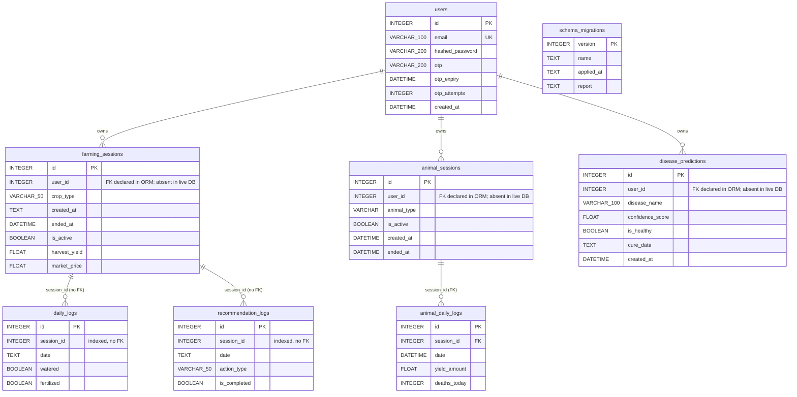

# DATABASE_SCHEMA.md

Store documentation for the **AI-Powered Agricultural Decision Intelligence System
for Precision Farming** ("Smart Farm" internally).

Authoritative sources for this document:

| Source | What it defines |
| --- | --- |
| `backend/database.py` | ORM models (SQLAlchemy 2.x declarative) |
| `backend/migrations/runner.py` | Migration runner, ledger, backup policy |
| `backend/migrations/m001_phase1_schema.py` | The only applied migration |
| `backend/app/deps.py` | Authentication and ownership enforcement |
| `backend/database.db` | Live SQLite file (untracked, gitignored) |

---

## 1. Purpose and scope

The store is a **single-file SQLite database** holding everything the local-first
API persists:

- accounts and password-reset state (`users`);
- the two farming session types the app manages - plant plots and animal
  husbandry - plus their per-day activity logs;
- the output of the plant-disease classifier (`disease_predictions`);
- an append-only trail of machine-generated agronomic advice
  (`recommendation_logs`);
- the schema migration ledger (`schema_migrations`).

**In scope of this document:** physical schema (tables, columns, types,
nullability, defaults, keys, indexes), relationships between tables, row
ownership rules, data-quality limitations, and the migration/backup procedure.

**Out of scope:** API request/response shapes, the decision engine, the ML model,
and the RAG knowledge base (`data/knowledge_base`, `data/vector_store` - these are
filesystem artefacts, not tables).

**Path resolution.** The database path is never hardcoded to the current working
directory. `backend/app/config.py:_path()` anchors a relative `DATABASE_PATH` to
the project root; the default resolves to `backend/database.db`.
`settings.database_url` is `sqlite:///<absolute posix path>`. The engine is created
with `check_same_thread: False` because the FastAPI threadpool shares connections.

**Foreign key enforcement.** SQLite ignores `FOREIGN KEY` clauses unless asked per
connection, so `backend/database.py` registers a `connect` event that issues
`PRAGMA foreign_keys=ON`. This is controlled by
`DATABASE_ENABLE_FOREIGN_KEYS` (default `True`) and is best-effort - a failure to
set the pragma is swallowed, in which case FK enforcement is silently off for that
connection.

**Timestamps.** Three conventions coexist and they are not interchangeable:

| Convention | Produced by | Example stored value |
| --- | --- | --- |
| ISO-8601 `TEXT`, `T` separator, **local** time | `datetime.now().isoformat()` in `main.py` | `2026-06-09T13:57:57.002695` |
| `DATETIME`, space separator, **UTC** | `datetime.utcnow()` in `database.py` and `main.py` | `2026-06-09 05:39:53.150737` |
| `DATETIME`, space separator, UTC | `datetime.utcnow().isoformat(sep=" ")` in migration 001 | `2026-09-25 15:13:43.054858` |

Read paths normalise through two helpers in `backend/database.py`:
`to_date_key(value)` collapses any stored form to `'YYYY-MM-DD'`, and
`to_datetime(value)` best-effort parses a stored string into a `datetime`
(returning `None` when nothing matches). Neither helper applies timezone
conversion, so UTC-stored and local-stored values are **not** directly
comparable.

---

## 2. Table reference

Eight tables exist: seven application tables plus the migration ledger. Row counts
below are approximate and were read from the live database at the time of
writing; they change as the app is used.

| Table | Purpose | Approx. rows |
| --- | --- | --- |
| `users` | Accounts | ~7 |
| `farming_sessions` | Plant plot sessions | ~7 |
| `daily_logs` | Per-day plant plot activity | ~4 |
| `animal_sessions` | Livestock sessions | ~2 |
| `animal_daily_logs` | Per-day livestock activity | ~2 |
| `disease_predictions` | Classifier output history | ~10 |
| `recommendation_logs` | Generated advisory trail | ~24 |
| `schema_migrations` | Migration ledger | 1 |

---

### 2.1 `users`

ORM: `User` in `backend/database.py`. Parent of every other user-owned table.

| Column | Type | Nullable | Default | Meaning |
| --- | --- | --- | --- | --- |
| `id` | `INTEGER` | no (PK) | auto | Surrogate primary key. |
| `name` | `VARCHAR(100)` | yes | none | Display name. |
| `email` | `VARCHAR(100)` | yes | none | Login identifier. **Unique.** |
| `hashed_password` | `VARCHAR(200)` | yes | none | Password hash. Never a plaintext or raw digest; never logged. |
| `otp` | `VARCHAR(200)` (ORM) / `VARCHAR(10)` (live) | yes | none | Password-reset code, stored only as a keyed digest (see discrepancy note below). |
| `otp_expiry` | `DATETIME` | yes | none | Expiry for the outstanding reset code. |
| `otp_attempts` | `INTEGER` | no (ORM) | `0` | Failed reset attempts; capped by `OTP_MAX_ATTEMPTS` (default 5). |
| `created_at` | `DATETIME` | yes | `datetime.utcnow` | Account creation time (UTC, space-separated). |

Keys and indexes:

- `PRIMARY KEY (id)`
- `UNIQUE INDEX ix_users_email ON users (email)` - the uniqueness constraint.
- `INDEX ix_users_id ON users (id)` - emitted by SQLAlchemy because `id` is
  declared `index=True`; redundant with the primary key but present in the live
  file.

Relationships:

- `users` 1 -> N `farming_sessions.user_id`
- `users` 1 -> N `animal_sessions.user_id`
- `users` 1 -> N `disease_predictions.user_id`

Notes:

- `email` and `hashed_password` are intentionally readable by the ORM but are
  never serialised into an HTTP response.
- `otp` holds a 64-character lowercase hex HMAC-SHA256 digest
  (`_otp_digest()` in `backend/main.py`), keyed by the deployment's JWT secret.
  The plaintext code is never persisted. Rotating `JWT_SECRET` invalidates every
  outstanding reset code.
- The live column is `VARCHAR(10)`, a Version-1 width that predates the Phase 2
  digest change. SQLite does not enforce `VARCHAR` length, so the digest is stored
  in full. See section 7.

---

### 2.2 `farming_sessions`

ORM: `FarmingSession` in `backend/database.py`. One plot of one crop for one user.
The economic heart of the plant side: investment in, harvest out.

| Column | Type | Nullable | Default | Meaning |
| --- | --- | --- | --- | --- |
| `id` | `INTEGER` | no (PK) | auto | Surrogate primary key. |
| `user_id` | `INTEGER` | yes | `NULL` | Owning account. Added by migration 001. |
| `crop_type` | `VARCHAR(50)` | yes | none | Crop, normalised to the canonical vocabulary (e.g. `Tomato`, `Potato`). |
| `plot_name` | `VARCHAR(100)` | yes | none | Human label for the plot. |
| `area_cents` | `FLOAT` | yes | none | Plot area in **cents** (1/100 acre). |
| `soil_type` | `VARCHAR(50)` | yes | none | Soil classification; drives moisture estimation. |
| `location` | `VARCHAR(100)` | yes | none | Free-text place name; passed to the weather provider. |
| `created_at` | `TEXT` | yes | none | ISO-8601 creation timestamp (`T` separator, local time). **Not** a `DateTime`. |
| `seed_qty` | `FLOAT` | yes | `0.0` | Seed quantity purchased. |
| `cost_per_seed` | `FLOAT` | yes | `0.0` | Unit seed cost. |
| `total_land_cost` | `FLOAT` | yes | `0.0` | Land preparation cost. |
| `fertilizer_qty` | `FLOAT` | yes | `0.0` | Fertilizer quantity purchased. |
| `cost_per_fertilizer` | `FLOAT` | yes | `0.0` | Unit fertilizer cost. |
| `is_active` | `BOOLEAN` | yes | `True` | `True` while open; set to `False` on close-out. |
| `harvest_yield` | `FLOAT` | yes | `NULL` | Realised yield in **kg**, set at close-out. |
| `market_price` | `FLOAT` | yes | `NULL` | Sale price per **kg**, set at close-out. |
| `ended_at` | `DATETIME` | yes | `NULL` | UTC close-out timestamp. Added by migration 001. |

Keys and indexes:

- `PRIMARY KEY (id)`
- `INDEX ix_farming_sessions_id ON farming_sessions (id)`
- `INDEX ix_farming_sessions_crop_type ON farming_sessions (crop_type)`
- No index on `user_id` (the ORM does not declare `index=True` on it), and **no
  foreign key constraint in the live file** - see section 7.

Relationships:

- `users` 1 -> N `farming_sessions` (via `user_id`)
- `farming_sessions` 1 -> N `daily_logs` (via `daily_logs.session_id`, unconstrained)
- `farming_sessions` 1 -> N `recommendation_logs` (via `recommendation_logs.session_id`, unconstrained)

Notes:

- Close-out is a state transition, not a delete: `POST /api/sessions/{id}/harvest`
  sets `is_active = False`, writes `harvest_yield` and `market_price`, and stamps
  `ended_at`. A second call returns HTTP 409 rather than overwriting the recorded
  harvest. Revenue is derived as `harvest_yield * market_price`; it is never
  stored.
- `created_at` is `TEXT` because the Version-1 demo data was written that way. The
  ORM comment and the module docstring both call this out explicitly. Read paths
  use `to_date_key()` so a `TEXT` value and a real `datetime` are handled alike.

---

### 2.3 `daily_logs`

ORM: `DailyLog` in `backend/database.py`. One day's activity for one plant
session.

| Column | Type | Nullable | Default | Meaning |
| --- | --- | --- | --- | --- |
| `id` | `INTEGER` | no (PK) | auto | Surrogate primary key. |
| `session_id` | `INTEGER` | yes | none | Owning `farming_sessions.id`. **Plain indexed integer, no FK constraint.** |
| `date` | `TEXT` | yes | none | ISO-8601 timestamp of the log entry (`T` separator, local time). **Not** a `DateTime`. |
| `watered` | `BOOLEAN` | yes | `False` | Crop was watered that day. |
| `water_reason` | `VARCHAR(200)` | yes | `NULL` | Why watering was or was not done. |
| `fertilized` | `BOOLEAN` | yes | `False` | Fertiliser applied that day. |
| `fertilizer_amount` | `FLOAT` | yes | `0.0` | Fertiliser quantity applied. |
| `weather_condition` | `VARCHAR` | yes | `NULL` | Free-text weather note (truncated to 100 chars on write). |
| `notes` | `VARCHAR` | yes | `NULL` | Free-text note (truncated to 1000 chars on write). |

Keys and indexes:

- `PRIMARY KEY (id)`
- `INDEX ix_daily_logs_id ON daily_logs (id)`
- `INDEX ix_daily_logs_session_id ON daily_logs (session_id)`
- **No foreign key.** The ORM does not declare `ForeignKey("farming_sessions.id")`
  here, so the database does not enforce the link either.

Relationships:

- `farming_sessions` 1 -> N `daily_logs`, expressed only by the value of
  `session_id` and the application query.

Notes:

- `watered` and `fertilized` are the direct inputs to the soil-moisture estimate
  used by the advisory endpoint, and `daily_logs.date` is normalised with
  `to_date_key()` before being compared to today's date key.
- There is **no `user_id` column.** A daily log is owned transitively: it belongs
  to whoever owns the referenced `farming_sessions` row.

---

### 2.4 `animal_sessions`

ORM: `AnimalSession` in `backend/database.py`. One herd / flock / group of animals
for one user.

| Column | Type | Nullable | Default | Meaning |
| --- | --- | --- | --- | --- |
| `id` | `INTEGER` | no (PK) | auto | Surrogate primary key. |
| `user_id` | `INTEGER` | yes | `NULL` | Owning account. Added by migration 001. |
| `animal_type` | `VARCHAR` | yes | none | Species, title-cased by migration 001 (e.g. `Cow`, `Hen`). |
| `session_name` | `VARCHAR` | yes | none | Human label for the session. |
| `animal_count` | `INTEGER` | yes | none | Number of animals at start. |
| `cost_per_animal` | `FLOAT` | yes | none | Purchase cost per animal. |
| `initial_food_qty` | `FLOAT` | yes | none | Opening feed quantity. |
| `cost_per_food_qty` | `FLOAT` | yes | none | Unit feed cost. |
| `medicine_cost` | `FLOAT` | yes | none | Opening medicine spend. |
| `shelter_cost` | `FLOAT` | yes | none | Opening shelter spend. |
| `is_active` | `BOOLEAN` | yes | `True` | `True` while open; `False` after close-out. |
| `animals_sold` | `INTEGER` | yes | `0` | Number sold at close-out. |
| `sell_price_per_animal` | `FLOAT` | yes | `0.0` | Realised price per animal. |
| `total_sale_revenue` | `FLOAT` | yes | `0.0` | `animals_sold * sell_price_per_animal`, written at close-out. |
| `created_at` | `DATETIME` | yes | `datetime.utcnow` | Session creation time (UTC). |
| `ended_at` | `DATETIME` | yes | `NULL` | UTC close-out timestamp. Added by migration 001. |

Keys and indexes:

- `PRIMARY KEY (id)`
- `INDEX ix_animal_sessions_id ON animal_sessions (id)`
- `INDEX ix_animal_sessions_animal_type ON animal_sessions (animal_type)`
- No index on `user_id`, and **no foreign key constraint in the live file.**

Relationships:

- `users` 1 -> N `animal_sessions` (via `user_id`)
- `animal_sessions` 1 -> N `animal_daily_logs` (via a real `FOREIGN KEY`)

Notes:

- Unlike the plant side, `total_sale_revenue` **is** persisted (recomputed on
  every close-out), whereas plant revenue is always derived on read.
- Close-out is idempotency-guarded: a repeat call on a closed session returns 409.

---

### 2.5 `animal_daily_logs`

ORM: `AnimalDailyLog` in `backend/database.py`. One day's husbandry record.

| Column | Type | Nullable | Default | Meaning |
| --- | --- | --- | --- | --- |
| `id` | `INTEGER` | no (PK) | auto | Surrogate primary key. |
| `session_id` | `INTEGER` | yes (FK) | none | References `animal_sessions (id)`. This is a **real** foreign key. |
| `date` | `DATETIME` | yes | `datetime.utcnow` | Log timestamp (UTC, space-separated). |
| `food_given_qty` | `FLOAT` | yes | none | Feed given that day. |
| `food_cost_today` | `FLOAT` | yes | none | Feed cost that day. |
| `yield_amount` | `FLOAT` | yes | none | Produce recorded that day (litres or eggs). |
| `yield_selling_price` | `FLOAT` | yes | none | Realised price per unit of produce. |
| `medicine_given` | `BOOLEAN` | yes | `False` | Medicine administered that day. |
| `medicine_name` | `VARCHAR` | yes | `NULL` | Name of the medicine given. |
| `medicine_cost` | `FLOAT` | yes | `0.0` | Cost of that day's medicine. |
| `medicine_reason` | `VARCHAR` | yes | `NULL` | Reason for the treatment. |
| `deaths_today` | `INTEGER` | yes | `0` | Mortality count that day. |
| `notes` | `VARCHAR` | yes | `NULL` | Free-text note. |

Keys and indexes:

- `PRIMARY KEY (id)`
- `INDEX ix_animal_daily_logs_id ON animal_daily_logs (id)`
- `FOREIGN KEY (session_id) REFERENCES animal_sessions (id)` - `NO ACTION` on
  delete and on update (SQLAlchemy default; no `ON DELETE CASCADE`).
- No index on `session_id`; lookups scan the table and sort by `date`.

Relationships:

- `animal_sessions` 1 -> N `animal_daily_logs`
- No `user_id`: ownership is inherited from the parent `animal_sessions` row.

Notes:

- This is the only child-of-session table in the schema with a genuine enforced
  foreign key. Contrast with `daily_logs` and `recommendation_logs`, which do not.
- `date` is a `DATETIME`, unlike the plant-side `daily_logs.date` which is `TEXT`.

---

### 2.6 `disease_predictions`

ORM: `DiseasePrediction` in `backend/database.py`. One row per classifier
inference, retained as the research history.

| Column | Type | Nullable | Default | Meaning |
| --- | --- | --- | --- | --- |
| `id` | `INTEGER` | no (PK) | auto | Surrogate primary key. |
| `user_id` | `INTEGER` | yes | `NULL` | Account the prediction is attributed to. Added by migration 001. |
| `crop_type` | `VARCHAR(50)` | yes | none | Crop label supplied by the caller. |
| `symptoms` | `TEXT` | yes | `NULL` | Free-text symptoms. |
| `location` | `VARCHAR(100)` | yes | `NULL` | Free-text location. |
| `disease_name` | `VARCHAR(100)` | yes | none | Predicted class label. |
| `confidence_score` | `FLOAT` | yes | none | Model confidence. |
| `is_healthy` | `BOOLEAN` | yes | none | `True` when the prediction is "healthy". |
| `severity` | `VARCHAR(20)` | yes | none | Severity label (e.g. `Mild`, `Severe`). |
| `cure_data` | `TEXT` | yes | none | **JSON-stringified** treatment/advice payload. |
| `created_at` | `DATETIME` | yes | `NULL` | UTC inference timestamp. Added by migration 001. |

Keys and indexes:

- `PRIMARY KEY (id)`
- `INDEX ix_disease_predictions_id ON disease_predictions (id)`
- `INDEX ix_disease_predictions_crop_type ON disease_predictions (crop_type)`
- `INDEX ix_disease_predictions_disease_name ON disease_predictions (disease_name)`
- The ORM also declares `index=True` on `user_id` and on `created_at`, but
  **neither index exists in the live file** (see section 7). There is also **no
  foreign key constraint** on `user_id` in the live file.

Relationships:

- `users` 1 -> N `disease_predictions` (via `user_id`, enforced in the application)

Notes:

- `cure_data` holds a JSON document in a `TEXT` column, not a normalised child
  table. It must be parsed with `json.loads` on read; there is no JSON column type
  in use.
- `created_at` was added late. Every pre-existing row was backfilled with the
  **migration timestamp**, not a real inference time - see section 6.

---

### 2.7 `recommendation_logs`

ORM: `RecommendationLog` in `backend/database.py`. Append-only trail of
machine-generated advice.

| Column | Type | Nullable | Default | Meaning |
| --- | --- | --- | --- | --- |
| `id` | `INTEGER` | no (PK) | auto | Surrogate primary key. |
| `session_id` | `INTEGER` | yes | none | Owning `farming_sessions.id`. **Plain indexed integer, no FK constraint.** |
| `date` | `TEXT` | yes | none | ISO-8601 timestamp (`T` separator, local time). **Not** a `DateTime`. |
| `action_type` | `VARCHAR(50)` | yes | none | Action class, e.g. `Water`, `Fertilize`. |
| `recommendation` | `TEXT` | yes | none | The advice text shown to the user. |
| `reason` | `TEXT` | yes | none | Why the engine produced that advice. |
| `is_completed` | `BOOLEAN` | yes | `False` | Whether the farmer acted on it. |

Keys and indexes:

- `PRIMARY KEY (id)`
- `INDEX ix_recommendation_logs_id ON recommendation_logs (id)`
- `INDEX ix_recommendation_logs_session_id ON recommendation_logs (session_id)`
- **No foreign key**, and no `user_id`.

Relationships:

- `farming_sessions` 1 -> N `recommendation_logs`, expressed only by `session_id`
  and the application query.

Notes:

- Rows are inserted by the advisory endpoint, two per call (one watering row and
  one fertilising row), then committed.
- **Nothing ever reads this table.** It is a write-only audit trail today; see
  section 6.

---

### 2.8 `schema_migrations` (migration ledger)

Not an ORM model. Created by raw DDL in
`ensure_migration_table()` in `backend/migrations/runner.py`, using
`CREATE TABLE IF NOT EXISTS`, so it exists on every database, even a freshly
created empty one.

| Column | Type | Nullable | Default | Meaning |
| --- | --- | --- | --- | --- |
| `version` | `INTEGER` | no (PK) | none | Monotonic migration number. |
| `name` | `TEXT` | no | none | Human-readable migration name. |
| `applied_at` | `TEXT` | no | none | UTC ISO-8601 application time (`datetime.utcnow().isoformat()`). |
| `report` | `TEXT` | yes | `NULL` | The `str()` of the report dict returned by the migration. |

Keys and indexes:

- `PRIMARY KEY (version)` - the implicit rowid alias; no secondary indexes.
- The runner writes with `INSERT OR REPLACE`, so re-running a version overwrites
  its own ledger row rather than failing.

Current contents: exactly one row, version `1`, name
`Phase 1 schema + data fixes`.

The `report` column is the only durable record of what a migration actually did.
For migration 001 it records four added columns, the crop-name rewrite map
(`potato` -> `Potato`, `tomato` -> `Tomato`), an empty animal-type rewrite map, and
a legacy-row reassignment count with the chosen owner id. Do not paste the raw
`report` string into documentation or issues - it contains the owner account's
email address.

---

## 3. Entity relationships

### 3.1 Diagram

```text
                        +------------------+
                        |      users       |
                        | PK id            |
                        | UQ email         |
                        +--------+---------+
                                 |
                 user_id (1)    |    (N) user_id
        +------------------------+------------------------+
        |                        |                        |
        v                        v                        v
+-------------------+   +-------------------+   +---------------------+
| farming_sessions  |   |  animal_sessions |   | disease_predictions |
| PK id             |   | PK id            |   | PK id               |
|    user_id        |   |    user_id        |   |    user_id          |
|    created_at TXT |   |    created_at     |   |    created_at       |
|    ended_at  DT   |   |    ended_at DT    |   |    cure_data  TEXT  |
+---------+---------+   +---------+---------+   +---------------------+
          |                       |
          | session_id            | session_id  (REAL FK)
          | (no FK, indexed)      | ON DELETE NO ACTION
          |                       |
          v                       v
+-------------------+   +---------------------+
|    daily_logs     |   |  animal_daily_logs  |
| PK id             |   | PK id               |
|    session_id     |   |    session_id       |
|    date      TEXT |   |    date   DATETIME  |
+-------------------+   +---------------------+

          ^
          | session_id (no FK, indexed, write-only)
          |
+-------------------+
| recommendation_   |
| logs              |
| PK id             |
|    session_id     |
|    date      TEXT |
|    is_completed   |
+-------------------+

   +------------------------+
   |   schema_migrations    |   (standalone ledger, no FKs)
   | PK version             |
   |    name / applied_at   |
   |    report              |
   +------------------------+
```

### 3.2 Mermaid



### 3.3 Which rows belong to which user

Ownership is **one level deep from `users`, two levels for child tables**:

| Table | How a row is attributed to a user |
| --- | --- |
| `users` | It is the user. |
| `farming_sessions` | Direct: `user_id`. |
| `animal_sessions` | Direct: `user_id`. |
| `disease_predictions` | Direct: `user_id`. |
| `daily_logs` | Indirect: `session_id` -> `farming_sessions.user_id`. No `user_id` column. |
| `recommendation_logs` | Indirect: `session_id` -> `farming_sessions.user_id`. No `user_id` column. |
| `animal_daily_logs` | Indirect: `session_id` -> `animal_sessions.user_id`. No `user_id` column. |
| `schema_migrations` | Not user data. |

Legacy rows were shipped with `user_id IS NULL`. Migration 001 reassigned them to
a single owner account so the Version-1 demo data remains visible in that
account's dashboards instead of being filtered out of every view. In the live
database no `farming_sessions`, `animal_sessions` or `disease_predictions` row has
a NULL owner.

---

## 4. Data ownership rules

**Rule: no endpoint reaches a row except through the authenticated user id.**

### 4.1 Identity

`get_current_user()` in `backend/app/deps.py` resolves the caller:

1. **Preferred - Bearer token.** `Authorization: Bearer <jwt>` from
   `/api/auth/login`. The `sub` claim is the `users.id`; the row is loaded with
   `_load_user()`. A missing account or an unparsable subject is a 401.
2. **Transitional - `X-User-Id` header.** Accepted only while
   `ALLOW_LEGACY_USER_HEADER` is true. It **defaults to false** because a
   client-supplied id is a spoofable identity claim. Every use is logged at
   warning level with the id so the cutover can be verified. `validate_startup()`
   refuses to start a production deployment with it enabled.
3. Otherwise: 401 with a `WWW-Authenticate: Bearer` challenge.

`get_optional_user()` wraps the same logic but returns `None` instead of raising.

### 4.2 Enforcement points

- **Single owned resource** - `get_owned_plant_session()` and
  `get_owned_animal_session()` load the row then call `_assert_owner()`.
  `_assert_owner()` produces:
  - `owner_id is None` -> **403**, logged as an error, with a message telling the
    operator to run the data migration. Ownerless rows are never handed out.
  - `owner_id != user.id` -> **403**, logged as a warning naming both ids. This is
    the fix for the Version-1 IDOR bugs.
  - Missing row -> **404**.
- **Collections** - every list, dashboard and summary query filters on
  `Model.user_id == current_user.id` in the `WHERE` clause (plant sessions, animal
  sessions and disease predictions). There is no unfiltered list endpoint.
- **Child rows** - `daily_logs`, `recommendation_logs` and `animal_daily_logs`
  have no `user_id`. They are reached only after
  `get_owned_plant_session()` / `get_owned_animal_session()` has already
  authorised the parent, and they are always queried by the known `session_id`.
  This is sound **because** the parent check runs first on every path.

### 4.3 The one gap: unconstrained `session_id`

> **Known limitation - stated explicitly, not hidden.**
> `daily_logs.session_id` and `recommendation_logs.session_id` are **plain
> indexed integers with no foreign key constraint**. The database will happily
> accept a `session_id` pointing at a non-existent `farming_sessions.id`, and
> SQLite will not reject a delete that strands child rows. `animal_daily_logs`
> is the only child table that actually has an enforced `FOREIGN KEY`.
>
> Mitigation today: application-layer ownership checking on the parent session is
> the only thing standing between a caller and another account's logs. Currently
> no orphaned `session_id` values exist in the live data, but nothing in the
> schema would prevent them.

The second half of the same limitation applies to the three `user_id` columns:
`farming_sessions.user_id`, `animal_sessions.user_id` and
`disease_predictions.user_id` are declared as `ForeignKey("users.id")` in the ORM
but the columns were added by `ALTER TABLE ... ADD COLUMN` in migration 001, and
**the live database contains no foreign key clause for them**
(`PRAGMA foreign_key_list` returns an empty set for all three). Deleting a user
would not cascade, complain, or be blocked at the database level.

---

## 5. Migrations

### 5.1 Mechanism

`backend/migrations/runner.py` implements an ordered, idempotent, versioned
runner:

- `MIGRATIONS` is a hard-coded list of `(version, module_path, name)` tuples.
  Currently one entry: `(1, "migrations.m001_phase1_schema", "Phase 1 schema +
  data fixes")`.
- `ensure_migration_table()` creates `schema_migrations` with
  `CREATE TABLE IF NOT EXISTS` and commits.
- `applied_versions()` reads the set of versions already in the ledger.
- `run_all()` computes `pending = [m for m in MIGRATIONS if m.version not in
  applied]`. If `pending` is empty it returns immediately with
  `current_version` - **this is why nothing is re-run on every start**.
- If anything is pending, `backup_database()` copies the whole `.db` file into
  `backend/backups/` first, then each pending migration is imported and its
  `apply(conn)` called on a fresh connection. Success writes a ledger row; failure
  rolls back, logs at error level, and re-raises so startup fails loudly.
- The returned report dict (`applied`, `skipped`, `backup`, `details`,
  `current_version`) is returned by `init_db()` in `backend/database.py` and is
  logged at startup, so every boot states exactly what changed.
- `init_db()` calls `Base.metadata.create_all(bind=engine)` **before** running
  migrations. This creates missing tables, but it does **not** add missing columns
  or missing indexes to tables that already exist - which is the entire reason
  the versioned migration exists.

### 5.2 Adding a migration

1. Create `backend/migrations/m00N_<short_name>.py`.
2. Give it a module-level `apply(conn: sqlite3.Connection) -> dict`. The dict you
   return is stringified into the ledger `report` column and into the startup log.
3. Use `add_column_if_missing(conn, table, column, ddl)` from
   `migrations.runner` for every `ALTER TABLE`. It is idempotent and commits.
4. **Never delete data.** Migration 001's contract is "add columns, fill gaps,
   normalise values". A migration that drops or truncates demo data is out of
   contract and out of policy.
5. Do not write raw emails, passwords or hashes into the report dict.
6. Register it in the `MIGRATIONS` list in `runner.py`, in ascending version
   order.
7. Start the app once. The runner will back up the database, apply the migration,
   and record the version. Confirm the ledger:
   `SELECT version, name, applied_at FROM schema_migrations;`
8. Do **not** renumber or edit an already-applied migration. Add a new one.

### 5.3 Migration 001 is already applied - read this before editing anything

`schema_migrations` already contains version `1`. The runner keys off that ledger
row, so:

> **Changing `LEGACY_DATA_OWNER_EMAIL` in `backend/.env` now has no effect.**
> `_resolve_legacy_owner()` in `m001_phase1_schema.py` only runs when version 1 is
> pending. It ran once, on first start, and it is not scheduled to run again. The
> reassignment it performed is permanent. Setting a different owner email will not
> move a single row, and there is no "undo" path. To actually re-home legacy data
> you must write a **new** migration (for example `m002_reassign_legacy_owner.py`)
> that performs the reassignment explicitly and registers itself as version 2.

This is intentional design, not a bug: the same "already applied, never
re-applied" rule is what guarantees a demo database cannot be silently mutated
just because an environment variable changed.

### 5.4 What migration 001 did

Schema changes (all four, confirmed in the ledger report):

| Change | Reason |
| --- | --- |
| `disease_predictions.created_at` (`DATETIME`) | Research analysis needs a capture time. |
| `farming_sessions.ended_at` (`DATETIME`) | Harvest timestamp. |
| `animal_sessions.ended_at` (`DATETIME`) | Close-out timestamp. |
| `users.otp_attempts` (`INTEGER DEFAULT 0`) | OTP brute-force protection. |

Data changes:

| Change | Effect |
| --- | --- |
| `UPDATE disease_predictions SET created_at = ... WHERE created_at IS NULL` | Backfilled every legacy prediction with the migration's own timestamp. See section 6. |
| Crop-name normalisation on `farming_sessions.crop_type` | Rewrote `potato` -> `Potato`, `tomato` -> `Tomato` through the canonical vocabulary in `app/crop_vocab.py`. |
| Animal-type title-casing on `animal_sessions.animal_type` | No changes were needed on this data set. |
| Legacy owner reassignment | Set `user_id` on every `user_id IS NULL` row in `farming_sessions`, `animal_sessions` and `disease_predictions` to a single account. |

Owner selection order in `_resolve_legacy_owner()`:

1. The account matching `LEGACY_DATA_OWNER_EMAIL` (case-insensitive). If the
   setting is empty or that account does not exist, a warning is logged.
2. Fallback: the **lowest** `users.id`.
3. If there are no users at all, the step is skipped and recorded as
   `{"count": 0, "reason": "no users exist yet"}`.

Note the scope limit: only `farming_sessions`, `animal_sessions` and
`disease_predictions` are touched. The child tables need no update because they
have no `user_id` column.

### 5.5 Demo data is never destroyed

`init_db()` runs `create_all()` and then additive migrations. The runner takes a
full backup before the first pending migration, and migration 001 only ever
`ALTER TABLE ... ADD COLUMN`, `UPDATE ... WHERE ... IS NULL`, or rewrite a
vocabulary value. No code path in `backend/migrations/` contains `DELETE`,
`DROP` or `TRUNCATE`. Removing a user through the UI therefore leaves their
sessions and predictions in place, still owned by a `user_id` that no longer
resolves - a data-quality issue in its own right, and a reason not to rely on the
application to clean up.

---

## 6. Known data-quality issues

These are **not** hypotheticals. They are present in the current data set and
they constrain what analyses can honestly claim.

### 6.1 Backfilled prediction timestamps destroy the time series

`disease_predictions.created_at` was added after the fact. Migration 001 ran a
single `UPDATE ... WHERE created_at IS NULL` and wrote **one** timestamp - the
migration's own execution time - into every legacy row. The result in the live
database is roughly ten prediction rows, **all carrying the identical timestamp**
of that single migration run, spanning predictions that were originally created
across different times and for different users.

Consequences:

- The historical predictions **cannot be used as a time series.** Any chart of
  prediction volume or confidence over time is flat and meaningless; any
  "trend" derived from it is an artefact of the migration.
- Any accuracy or confidence statistic that buckets by date is invalid for the
  pre-migration rows. New predictions recorded after the migration do carry real
  UTC timestamps, so only post-migration rows are analysable.
- The damage is not detectable by inspecting a single row - it is only visible by
  noticing that `created_at` is constant across rows whose `id` values are far
  apart. Treat every row with `id` at or below the migration's high-water mark as
  undated.

### 6.2 Mixed temporal types and mixed formats

Four columns named as if they were instants are not `DateTime`:

| Table | Column | Declared type | What is actually stored |
| --- | --- | --- | --- |
| `farming_sessions` | `created_at` | `TEXT` | `2026-06-09T11:55:08.273253` (`T` separator, local time) |
| `daily_logs` | `date` | `TEXT` | `2026-06-09T13:57:57.002695` (`T` separator, local time) |
| `recommendation_logs` | `date` | `TEXT` | `2026-06-09T11:55:09.484447` (`T` separator, local time) |

The rest are `DateTime`:

| Table | Column | What is actually stored |
| --- | --- | --- |
| `animal_daily_logs` | `date` | `2026-06-09 05:39:53.150737` (space separator, **UTC**) |
| `animal_sessions` | `created_at` | `2026-06-09 05:35:36.553874` (space separator, **UTC**) |
| `users` | `created_at`, `otp_expiry` | UTC, space-separated |
| `farming_sessions` / `animal_sessions` | `ended_at` | UTC, space-separated |
| `disease_predictions` | `created_at` | UTC, space-separated |

Two compounding problems:

1. **Type split.** Sorting or comparing a `TEXT` ISO value against a `DateTime`
   value across tables is lexicographic vs. chronological, and the two families do
   not sort against each other reliably.
2. **Timezone split, within the same column.** The `TEXT` columns are written with
   `datetime.now()` (local time); the `DateTime` columns are written with
   `datetime.utcnow()` (UTC). `animal_sessions.created_at` and `daily_logs.date`
   are the same real-world instant expressed in different zones.

Mitigation: never read these columns raw. Go through `to_date_key()` (collapses to
`YYYY-MM-DD`) or `to_datetime()` (best-effort parse, `None` on failure). Neither
performs timezone conversion, so cross-table time arithmetic across the two
families is still unsound.

### 6.3 `recommendation_logs` is written but never read

The advisory endpoint inserts two `RecommendationLog` rows per call - a watering
row and a fertilising row - and commits them. A full-codebase search finds the
model imported in exactly one place beyond `backend/database.py`, and the only
other use is that insert. **No endpoint, dashboard, or report queries this
table.**

Consequences:

- The table is a write-only audit trail. Its row count (roughly 24 on a database
  with roughly 7 plant sessions) is a count of advisory calls, not of advice
  acted upon.
- `is_completed` is permanently `False`; nothing ever updates it.
- Any statistic derived from it - acceptance rate, advice volume per session over
  time - is currently unavailable. Note also that its `date` column is `TEXT`, so
  it could not be trended reliably even if an endpoint did read it.
- It grows without bound, and because `session_id` has no foreign key and no
  cascade, closing or deleting a session does not clean it up.

### 6.4 No harvest-date field on close-out

`farming_sessions` records `created_at` (TEXT) and `ended_at` (DATETIME), but there
is **no column for the date the crop was actually harvested**. The close-out
endpoint stamps `ended_at = datetime.utcnow()` at the moment the farmer submits
the harvest form, and that is the only temporal record of the event.

`animal_sessions` has the same gap: `created_at` and `ended_at` only, no
close-out date distinct from the submission instant.

Consequences:

- Growing-season duration must be derived from `ended_at - created_at`, which
  mixes a `TEXT` local value with a `DATETIME` UTC value (section 6.2).
- A harvest entered retrospectively - a common real case - is recorded as having
  happened now. Season length, time-to-harvest and any per-day rate metric
  computed from it are wrong for every back-entered harvest.
- There is no way to distinguish "harvested today" from "harvested three weeks
  ago and logged today".

### 6.5 Other observations

- `farming_sessions.area_cents` is in **cents**, not acres or hectares. Any
  figure quoted from it must state the unit; a bare "area" is ambiguous.
- `disease_predictions.crop_type` was **not** normalised by migration 001 - the
  crop-name fix only touches `farming_sessions.crop_type`. The live
  `disease_predictions.crop_type` values include `Tomato` and `Unknown`, while
  `farming_sessions.crop_type` values are only canonical (`Tomato`, `Potato`).
  Joining the two on `crop_type` will silently drop rows.
- Revenue is stored for the animal side (`total_sale_revenue`) and derived on the
  fly for the plant side. Any cross-side comparison must remember this asymmetry.
- `users.email` is nullable in the schema despite being the login identifier, and
  is not case-normalised on write. The advisory endpoint lower-cases the address
  at send time, which is a hint that case handling is not settled in the column.

---

## 7. ORM vs. live SQLite: verified discrepancies

These were found by comparing `backend/database.py` against
`PRAGMA`/`sqlite_master` output from `backend/database.db`.

**Migration 002 closed the first five.** The table below records both the original
finding and what now holds, because the root cause is worth understanding for any
future migration.

| # | Object | ORM declares | State before migration 002 | State now | Impact |
| --- | --- | --- | --- | --- | --- |
| 1 | `farming_sessions.user_id` | `ForeignKey("users.id")` | `user_id INTEGER DEFAULT NULL`, **no FK clause** (`PRAGMA foreign_key_list` empty) | **FK present** (`user_id -> users.id`) | `PRAGMA foreign_keys=ON` is now enforced for this column |
| 2 | `animal_sessions.user_id` | `ForeignKey("users.id")` | no FK clause | **FK present** | Same as above |
| 3 | `disease_predictions.user_id` | `ForeignKey("users.id")` | no FK clause | **FK present** | Same as above; the column is also set from the authenticated user only |
| 4 | `disease_predictions.user_id` index | `index=True` | **index did not exist** - "my predictions" was a full table scan | **`ix_disease_predictions_user_id` created** | History queries are indexed |
| 5 | `disease_predictions.created_at` index | `index=True` | **index did not exist** | **`ix_disease_predictions_created_at` created** | Time-bucketed analysis is indexed |
| 6 | `users.otp` | `String(200)` | `VARCHAR(10)` | `VARCHAR(10)` - unchanged | A Version-1 column width. SQLite does not enforce `VARCHAR` length, so the 64-character HMAC digest is stored in full and reset works - but the DDL understates the capacity. |
| 7 | `users.otp_attempts` | `nullable=False` | `INTEGER DEFAULT 0`, no `NOT NULL` | unchanged | The Python-side `nullable=False` rejects `None` through the ORM, but a direct SQL `INSERT` could store NULL and the attempt counter would then break. |
| 8 | `daily_logs.session_id`, `recommendation_logs.session_id` | no FK declared | no FK | unchanged, deliberately | Documented as a known limitation in section 4.3 - daily logs are routinely posted for sessions that predate the auth layer. |
| 9 | Row count of dated predictions | the brief assumed 9 historical predictions | the migration ledger reports `predictions_timestamped: 10`, and all 10 rows share one backfilled timestamp | unchanged | The count is 10, not 9. The underlying problem (all of them undated) is unchanged. |

The root cause behind the original rows 1-5 is worth understanding: **`create_all()`
is not a schema-upgrade tool.** It creates tables that do not exist. It does not add
columns to existing tables, and it does not create indexes or foreign keys for
columns that were added by a migration. Every column added by
`ALTER TABLE ... ADD COLUMN` arrives without its ORM-declared index and - because
SQLite cannot attach a `REFERENCES` clause to a column added that way - without its
foreign key. Migration 002 therefore rebuilt the three affected tables
(create, copy, drop, rename, recreate indexes) rather than altering them in place.
Any future migration that adds an indexed or constrained column must create that
index or constraint explicitly.

Indexes actually present in the live database - 18 in total:

| Index | Table | Unique |
| --- | --- | --- |
| `ix_users_id` | `users` | no |
| `ix_users_email` | `users` | **yes** |
| `ix_farming_sessions_id` | `farming_sessions` | no |
| `ix_farming_sessions_crop_type` | `farming_sessions` | no |
| `ix_farming_sessions_user_id` | `farming_sessions` | no |
| `ix_daily_logs_id` | `daily_logs` | no |
| `ix_daily_logs_session_id` | `daily_logs` | no |
| `ix_animal_sessions_id` | `animal_sessions` | no |
| `ix_animal_sessions_animal_type` | `animal_sessions` | no |
| `ix_animal_sessions_user_id` | `animal_sessions` | no |
| `ix_animal_daily_logs_id` | `animal_daily_logs` | no |
| `ix_disease_predictions_id` | `disease_predictions` | no |
| `ix_disease_predictions_user_id` | `disease_predictions` | no |
| `ix_disease_predictions_crop_type` | `disease_predictions` | no |
| `ix_disease_predictions_disease_name` | `disease_predictions` | no |
| `ix_disease_predictions_created_at` | `disease_predictions` | no |
| `ix_recommendation_logs_id` | `recommendation_logs` | no |
| `ix_recommendation_logs_session_id` | `recommendation_logs` | no |

Foreign keys actually present in the live database - four:

| Table | Column | References | On delete |
| --- | --- | --- | --- |
| `farming_sessions` | `user_id` | `users(id)` | NO ACTION |
| `animal_sessions` | `user_id` | `users(id)` | NO ACTION |
| `disease_predictions` | `user_id` | `users(id)` | NO ACTION |
| `animal_daily_logs` | `session_id` | `animal_sessions(id)` | NO ACTION |

`PRAGMA foreign_key_check` returns no violations, and `PRAGMA integrity_check`
returns `ok`.

A structure-only dump for review can be produced with (read-only, no writes):

```
& "C:\Users\Dhanush\AppData\Local\Programs\Python\Python310\python.exe" -c "import sqlite3; c=sqlite3.connect('file:backend/database.db?mode=ro', uri=True); [print(r[0]) for r in c.execute('select sql from sqlite_master where sql is not null')]"
```

`.gitignore` un-ignores `backend/database.schema.sql` for exactly this purpose: a
committed, structure-only copy is allowed, while `backend/database.db` itself
holds account emails and password hashes and is never tracked.

---

## 8. Backup and restore

### 8.1 Where backups live

`<database directory>/backups/` - for the real database that is
`backend/backups/`, which is created on demand by `backup_database()` and is
gitignored. The location follows the database rather than being hard-coded, so a
test run pointed at a scratch file writes its backup into the temporary directory
instead of the project tree.

Naming: `{database stem}_{tag}_{YYYYMMDD_HHMMSS}.db` - for example
`database_pre_migration_20260925_204342.db`. The default `tag` is
`pre_migration`.

A full copy of the current directory (filenames abbreviated here) also contains a
hand-taken baseline (`database_baseline_2026-09-25.db`) and an `.env` baseline.
Treat the `.env` baseline as a secret: it exists so settings can be reconstructed,
and it must not be committed or shared.

### 8.2 When a backup is taken

Automatically, by `run_all()`, and only when it matters:

- `backup_database()` returns `None` immediately if the database file does not
  exist - there is nothing to back up on a first run.
- Otherwise `shutil.copy2()` copies the file and the path is recorded in the
  migration report (`report["backup"]`) and logged.

**No backup is taken when there is nothing to migrate.** Once version 1 is in the
ledger, `run_all()` returns before reaching `backup_database()`. Restarting the
app does not create backups. This matters when reading the directory: many
`test_pre_migration_*.db` files are from test runs against scratch databases, not
from production starts.

The copy is a filesystem copy of the `.db` file, not a `VACUUM INTO` or
`sqlite3.Connection.backup()`. If a write is in flight at that moment, the copy
can in principle be torn. Migrations run at startup before serving traffic, so in
practice the file is quiet at that moment - but do not point the runner at a live
production database and expect the backup to be transactionally consistent.

### 8.3 Restore procedure

1. **Stop the application.** Do not restore under a running server; the restored
   file and the open connection will diverge.
2. **Back up the current state first**, so the restore is itself reversible:
   ```powershell
   Copy-Item -LiteralPath "backend\database.db" -Destination "backend\backups\database_pre_restore_$(Get-Date -Format 'yyyyMMdd_HHmmss').db"
   ```
3. **Pick the backup** by listing the directory with its timestamps:
   ```powershell
   Get-ChildItem -LiteralPath "backend\backups" -Filter *.db | Sort-Object LastWriteTime -Descending
   ```
   The newest `*_pre_migration_*.db` is the state immediately before the last
   applied migration - the correct rollback point for undoing a bad migration.
4. **Copy it over the live file:**
   ```powershell
   Copy-Item -LiteralPath "backend\backups\<chosen>.db" -Destination "backend\database.db" -Force
   ```
5. **Start the application once.** The migration runner will notice the restored
   file's ledger state and re-apply anything pending (re-taking its own backup
   first), then log the resulting report.
6. **Verify** row counts and the ledger:
   ```powershell
   & "C:\Users\Dhanush\AppData\Local\Programs\Python\Python310\python.exe" -c "import sqlite3; c=sqlite3.connect('file:backend/database.db?mode=ro', uri=True); print(list(c.execute('select version, name, applied_at from schema_migrations'))); print([(r[0], c.execute('select count(*) from '+r[0]).fetchone()[0]) for r in c.execute(\"select name from sqlite_master where type='table' order by name\")])"
   ```
7. Note that restoring an older file also rolls the **ledger** back. Any migration
   that ran after that backup will be re-applied on the next start. That is the
   intended behaviour, but it means a restore can re-run data fixes - which is
   safe by design precisely because migrations are additive and idempotent.

### 8.4 Handling rules

- A backup contains real account emails and password hashes. It has the same
  handling requirements as the live database: keep it inside `backend/backups/`,
  never commit it, never attach it to an issue, never paste its contents into a
  document.
- The `schema_migrations.report` column also contains an email address. Redact it
  before quoting.
- Backups are not pruned automatically. Prune deliberately, and keep at least the
  newest baseline plus one pre-migration copy per applied version.

---

## 9. Quick reference

| Question | Answer |
| --- | --- |
| Where is the database file? | `backend/database.db` (gitignored), path resolved from the project root. |
| How many tables? | 8 - 7 application tables plus `schema_migrations`. |
| How many enforced foreign keys? | 1 - `animal_daily_logs.session_id` -> `animal_sessions.id`. |
| How many indexes? | 14 in the live file. Two ORM-declared indexes are missing (see section 7). |
| Which migration versions are applied? | Version 1 only. |
| How do I add a column? | New numbered migration using `add_column_if_missing()`, registered in `MIGRATIONS`. |
| Why did my `LEGACY_DATA_OWNER_EMAIL` change do nothing? | Migration 001 is already recorded in the ledger and never re-runs. Write a new migration. |
| Is demo data ever deleted? | No. `create_all` plus additive migrations only; no `DELETE`, `DROP` or `TRUNCATE` anywhere in `backend/migrations/`. |
| Where do I restore from? | `backend/backups/`, newest `*_pre_migration_*.db` for a migration rollback. |
| Can I query the historical predictions by date? | No. Every legacy `created_at` was backfilled with the migration timestamp. |
